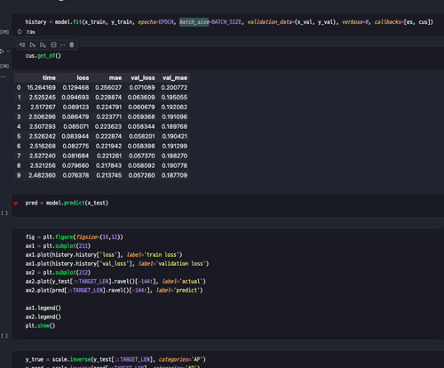

# 개인용 모듈

## .
1. callbacks.py
```
Tensorflow 저 수준 및 Pytorch 훈련 시 EarlyStopping 구현
Customhistory = 주피터 노트북에서만 지원함. 훈련 시 그래프와 판다스데이터프레임으로 표현됨 - 텐서플로우만 지원
```
CustomHistory


2. loaders.py
```
판다스 csv 로더, 같은 데이터이면서 따로 나누어진 상황 때 쓸려고 만듬
```

3. metrics.py
```
각종 오차율 계산하기 위해서 제작됨
```

4. preprocessing.py
```
사이킷런의 스케일링 함수가 불편해서 제작함
```

5. selections.py
```
    시계열 데이터의 데이터셋 나눌 기 위해서 제작
```
6. tstool.py
```
    시계열 데이터의 훈련용 데이터, 분기, 날짜 나누기, 신호 데이터 관련해서 생성하는 함수들 이 있음
```